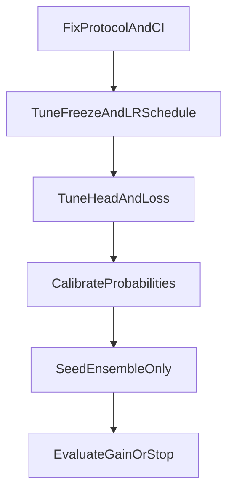

# ProteinBERT 接近 AUC=0.952 计划

## 目标与边界

- 目标：在现有数据集（`anticrispr_binary.train/test.csv`）不变条件下，尽可能将 ProteinBERT 测试 AUC 从当前约 `0.90` 提升，向 `0.952` 靠近。
- 边界：不依赖交叉注意力、不过度依赖人工特征融合、不做复杂 stacking。
- 判据：所有优化必须在同一评估协议下比较，避免“看起来提升但不可复现”。

## 现状结论（基于当前 notebook 输出）

- 当前较稳的主线仍是原始 ProteinBERT 微调（多种子约 `AUC 0.90`）。
- 交叉注意力/手工特征路线未带来稳定增益，且有引入噪声风险。
- 训练策略中“全程不冻结”明显退化（过拟合/训练不稳）。
- 下采样在当前数据量下不优于全量训练。

## 关键文件

- 主实验文件：`[/home/nemophila/projects/protein_bert/anticrispr_demo.ipynb](/home/nemophila/projects/protein_bert/anticrispr_demo.ipynb)`
- 微调流程实现：`[/home/nemophila/projects/protein_bert/proteinbert/finetuning.py](/home/nemophila/projects/protein_bert/proteinbert/finetuning.py)`
- 微调模型生成：`[/home/nemophila/projects/protein_bert/proteinbert/model_generation.py](/home/nemophila/projects/protein_bert/proteinbert/model_generation.py)`
- （参考）人工特征实现：`[/home/nemophila/projects/protein_bert/proteinbert/feature_extraction.py](/home/nemophila/projects/protein_bert/proteinbert/feature_extraction.py)`

## 执行策略（按优先级）

### 阶段1：先把评估协议“钉死”

1. 固定随机种子集合（建议 5 个以上）与统一数据切分流程。
2. 固定阈值选择规则：仅在验证集选阈值，测试集只评一次。
3. 统一输出：AUC、AUPRC、F1、MCC、Brier、ECE + bootstrap CI。
4. 引入“提升门槛”：只有当 `AUC` 与 `AUPRC` 同时提升且跨种子稳定，才接受新配置。

### 阶段2：ProteinBERT 微调主流程网格化（不改数据）

1. 系统搜索冻结/解冻日程：
  - 冻结→解冻（当前主线）
  - 缩短冻结期
  - 逐层解冻（而非一步全开）
2. 学习率三段联调：`lr_frozen`、`lr_unfrozen`、`final_lr`。
3. 序列长度策略：
  - 仅 512
  - 512→1024（控制 final epoch 数，避免最后阶段扰动）
4. dropout 与 early stopping/patience 联调，目标是降低种子方差。

### 阶段3：分类头与损失函数最小增强（仍是 ProteinBERT）

1. 在 `[model_generation.py](/home/nemophila/projects/protein_bert/proteinbert/model_generation.py)` 增加可选“轻量两层头”（LN + Dense + Dropout + Dense）。
2. 对比损失与不平衡处理：
  - `binary_crossentropy + class_weight`
  - `focal_loss`（仅作为对照，不做复杂组合）
3. 禁止叠加过多技巧：每次只改变 1 个变量做可归因对照。

### 阶段4：校准与决策稳定性（冲刺 AUC/AUPRC 的必要项）

1. 对最佳 2-3 个模型做概率校准（Platt/Isotonic 二选一或都测）。
2. 重点观察 AUPRC 与 F1 是否因校准提升而变稳。
3. 若只涨 F1 不涨 AUC/AUPRC，视为阈值层改进，不计入“模型实质提升”。

### 阶段5：轻量集成（仅在同构 ProteinBERT 内）

1. 使用“同一主流程不同种子”进行概率平均（seed ensemble）。
2. 不引入异构模型与 stacking。
3. 以最小复杂度换取方差下降与尾部样本鲁棒性。

### 阶段6：上限判断与停止条件

1. 若经过阶段1-5后，AUC 仍稳定停在 `0.90~0.92`，则判定“当前数据+ProteinBERT设定”存在性能天花板。
2. 给出可执行结论：
  - 已达到该数据条件下的最优区间；
  - `0.952` 若要逼近，需额外信息源（这一步仅作结论，不在本轮执行）。

## 里程碑与验收

- 里程碑1：完成统一协议，复现基线并输出多种子置信区间。
- 里程碑2：得到一个“显著优于当前基线”的微调配置（非单次偶然）。
- 里程碑3：完成同构 seed ensemble，给出最终可复现实验结论。
- 最终验收：
  - 主结果表（各阶段最佳配置）
  - 显著性/置信区间对比
  - 是否接近 `0.952` 的现实判断与下一步建议

## 计划文件落地说明

- 我会先通过计划系统生成方案供你确认。
- 你确认后执行阶段，我再将同内容同步保存到项目目录（如 `[/home/nemophila/projects/protein_bert/PROTEINBERT_0952_PLAN.md](/home/nemophila/projects/protein_bert/PROTEINBERT_0952_PLAN.md)`）。

