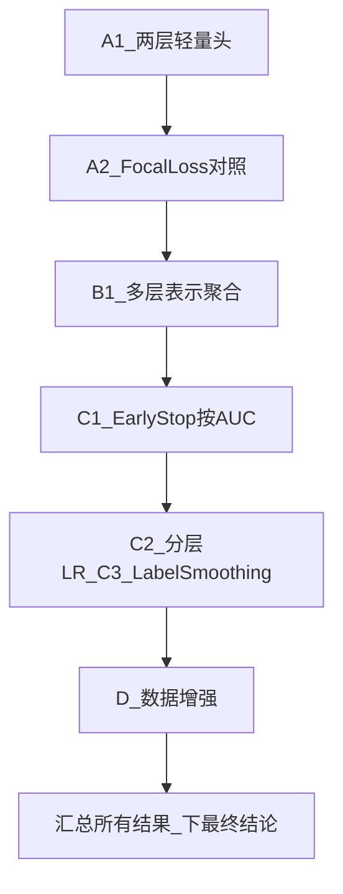

# ProteinBERT 剩余可行路线（无 PSSM / 无其他模型）

## 当前已确认的数字基线

- 基线（Exp5, 5 种子）：**AUC=0.8809, AUPRC=0.5818**
- 最佳种子集成（Exp8, G5_less_dropout+none）：**AUC=0.8959, AUPRC=0.6009, CI=(0.835, 0.943)**
- 距目标 0.952 还差约 **0.056**
- 校准（Platt/Isotonic）对 AUC 无帮助
- 645 维手工特征 / 交叉注意力 / 下采样均为**负结果**

## 已穷尽的方向（不再重复）

- 微调超参网格（冻结策略、学习率、序列长度、dropout、是否冻结等 7 种配置）
- 概率校准（Platt / Isotonic）
- 645 维手工特征 + 各种融合方式
- 交叉注意力头
- 类别不平衡 / 下采样策略
- 同构种子集成（已做，AUC 0.8959）

## 路线 A：分类头改造（改 `model_generation.py`）

当前分类头极简：`Dropout -> Dense(1, sigmoid)`，对应 `[model_generation.py` L122-130](proteinbert/model_generation.py)。

**A1. 两层轻量头**

- 在 Dropout 和 Dense(1) 之间插入：`LayerNormalization -> Dense(128, relu) -> Dropout(0.3) -> Dense(1, sigmoid)`
- 给 `FinetuningModelGenerator` 加一个 `head_type` 参数（'default' / 'two_layer'），不影响原有逻辑
- 在 notebook 中同一协议（5 种子）下对照：默认头 vs 两层头

**A2. Focal Loss 替换 BCE**

- 实现一个简单的 `focal_loss(gamma=2, alpha=0.25)` 函数
- 在 `model.compile(loss=...)` 处替换
- 对照：BCE vs focal（默认头）；BCE vs focal（两层头）
- 每次只改一个变量

## 路线 B：表示聚合方式（改 `conv_and_global_attention_model.py`）

当前 `get_model_with_hidden_layers_as_outputs` 把多层 global 输出做 concat，但 `FinetuningModelGenerator.create_model` 只取 `pretraining_output_annoatations_layer`（即最后一层的 global 输出），**没有用到 concat 后的多层表示**。

**B1. 多层拼接 / 加权和**

- 修改 `create_model`，让分类头接收 `concatenated_global_output`（即 `[conv_and_global_attention_model.py` L145](proteinbert/conv_and_global_attention_model.py) 的多层 concat 输出），而不是只用最后一层
- 或者用 `Dense(1, sigmoid)` 做可学习加权和（即 attention pooling over layers）
- 多层表示包含更丰富的层级信息，有可能改善判别

**B2. 序列维度 attention pooling**

- 对 seq 输出（三维张量）做 attention pooling（而不是依赖原始 global 分支），再分类
- 相当于让模型自己学哪些位置重要，而非只用预训练时的 global annotation 分支

## 路线 C：训练策略微调（在 notebook 中实现）

**C1. Early stopping 按 val_AUC 而非 val_loss**

- 当前 EarlyStopping 监控 `val_loss`，但 val_loss 最优点未必是 AUC 最优点
- 加一个自定义 Callback，每 epoch 在 valid 上算 AUC，按 AUC 做 early stopping 和 restore best weights

**C2. 分层学习率**

- 底层（预训练层）用更小 lr（如 1e-5），顶层（分类头）用更大 lr（如 1e-3）
- 需要小改 `ModelGenerator.train`，对不同 layer group 设不同 lr
- 在小数据微调中，分层 lr 可能比全局 lr 更稳

**C3. Label smoothing**

- 把 label 从 {0,1} 改为 {epsilon, 1-epsilon}（如 epsilon=0.05）
- 一行改动，作为正则化手段，可能略减过拟合

## 路线 D：轻量数据增强（在 notebook 中实现）

**D1. 序列随机截断**

- 对训练集序列随机截断到 80%~100% 长度，制造"伪样本"
- 利用 ProteinBERT 能处理变长序列的能力
- 每个 epoch 随机截断，相当于在线增强

**D2. 氨基酸随机替换**

- 按照 BLOSUM62 替换矩阵，以低概率（如 5%）对训练序列做点突变
- 产生微扰样本，类似于文本数据增强里的 synonym replacement
- 训练时在线生成，不改变验证/测试集

## 预期与建议

- **路线 A**（头 + 损失）和 **路线 B**（表示聚合）：改动量小、可归因，且是唯一还没碰过的"模型层面"杠杆，**优先做**
- **路线 C**（训练策略）：改动更小，可与 A/B 搭配
- **路线 D**（数据增强）：实验性更强，作为"最后尝试"
- 每条路线单变量对照、5 种子评估、同一协议；若均无稳定提升，则可以**明确下结论**：在当前数据 + ProteinBERT 下天花板约 0.89-0.90（集成可到 ~0.896），要逼近 0.952 必须引入进化信息（PSSM）或换模型

## 实施顺序

